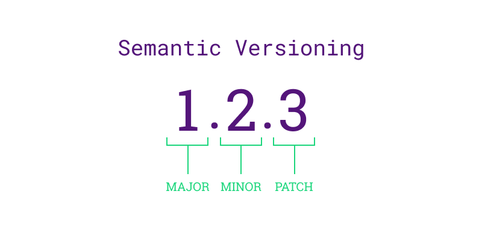

:::::::::::::::::::::::::::::::::::::: questions

- Why is versioning essential in software development? What problems can arise if versioning is not properly managed?
- How can automation tools, such as those for version bumping, improve the software development process?
- Why is it important to maintain consistency and transparency in software releases?

::::::::::::::::::::::::::::::::::::::::::::::::

::::::::::::::::::::::::::::::::::::: objectives

- Explain why versioning is crucial for software development, particularly in maintaining reproducibility and ensuring consistent behaviour of the code after changes.


::::::::::::::::::::::::::::::::::::::::::::::::

## Introduction

In previous episodes, we developed a basic Python/R package to demonstrate the importance of software reproducibility. However, a crucial question that we haven't addressed yet is: _how can we, as the developers, ensure that a change in our package's source code does not result in the code failing or behaving incorrectly?_ This is also an important consideration for when you are releasing your package.

::::::::::::::::::::::::::::::::::::: discussion

One of the pitfalls of packaging is to fall into poor naming conventions, even for scripts. For instance, how many times have you worked on scripts that was named `my_script_v1.py` or `my_script_final_version.py`? What were your main challenges with this approach, and what alternative solutions can you think of to circumvent this naive approach?

::::::::::::::::::::::::::::::::::::::::::::::::


## Semantic Versioning

<figure style="text-align: center;">
    
    <figcaption><em>The framework of semantic versioning is described by three version numbers, major, minor and patch</em>.</figcaption>
</figure>


The answer the question above is based on a concept called `versioning`. Versioning is the practice of assigning unique version numbers to different states or releases of a given package to track its development, improvements, and bug fixes over time. The most popular approach for software packaging is to use the [Semantic Versioning](https://semver.org/) framework, and can be summarised as follows:

```
Given a version number X.Y.Z, where X is the major version, Y is the minor version and Z is the patch version, you increment:

X when you make incompatible API changes,

Y when you add functionality in a backwards compatible manner,

Z when you make backwards compatible bug fixes. 


```

::::::::::::::::::::::::::::::::::::: callout

# Recall: API

An Application Programming Interface (API) is the name given to the way different programs or parts of a program to communicate with each other. It provides a set of functions, methods that can be used to interact with a piece of software or data services. Commonly, APIs are used within web-based applications to enable users to receive information from a given service, such as logging into social media accounts, creating weather widgets, or finding geographical locations. 

::::::::::::::::::::::::::::::::::::::::::::::::

The first version of any package typically starts at 0.1.0, and any changes following the semantic versioning rules above results in an increment to the appropriate version numbers. For example, updating a software from version (0.1.0) to (**1**.0.0) is called a `major` release. Version (**1**.0.0) is commonly referred to as the `first stable release` of the package.


An important point to highlight is the semantic versioning guidance above is a general rule of thumb.
Exactly when you decide to bump the versions of your package is dependent on you, as the developer, to be able to make that decision.
Developers typically take the size of the project into account as a factor; for example, small packages may require a patch release for every individual bug that is fixed.
On the other hand, larger packages often group multiple bug fixes into a single patch release to help with tractability because making a release for every fix would accumulate in a myriad of releases, which can be confusing for users and other developers.
The table below shows 3 examples of major, minor and patch releases developers made for the Python language itself. 


| Release Type  | Version Change | Description                                          |
|------------------------|-------------------------|--------------------------------------------------------------------------------|
| Major Release | 2.0.0 to 3.0.0 | Introduced significant and incompatible changes, such as the print function and new syntax.  |
| Minor Release | 3.7.0 to 3.8.0 | Added new features like the walrus operator and positional-only parameters, backward-compatible. |
| Patch Release | 3.8.0 to 3.8.1 | Fixed bugs and made performance improvements without adding new features or breaking changes. |

<figure style="text-align: center;">
    <figcaption><em>Table 1: Examples of major, minor and patch releases of the Python language</em>.</figcaption>
</figure>

::::::::::::::::::::::::::::::::::::: callout

# Pre-release Versions

Pre-release versions in semantic versioning are versions of the software that are still in development or testing before a stable release. They are denoted by appending a hyphen and a series of dot-separated identifiers to the version number, such as 1.0.0-alpha or 1.0.0-beta.1. These versions allow developers to release early versions for testing and feedback while clearly indicating their status.

::::::::::::::::::::::::::::::::::::::::::::::::

::::::::::::::::::::::::::::::::::::: callout

Once we publicly release a version of our software, it is crucial to maintain consistency and avoid altering it retroactively. Any necessary fixes needs to be addressed through subsequent releases, typically indicated by an increment in the patch number. 
For instance, Python 2 reached its final version, 2.7.18, in 2020, more than a decade after the release of Python 3.0. If the developers decided to discontinue support for an older version, leaving vulnerabilities unresolved, they would have to transparently communicate this to their users and encourage them to upgrade.

::::::::::::::::::::::::::::::::::::::::::::::::


::::::::::::::::::::::::::::::::::::: challenge

## Challenge 1: Semantic Versioning Decision Making

Imagine you are a developer working on a library called `DataTools`, which provides various utilities for data manipulation.
The library uses semantic versioning and is currently at version 1.2.3.
You have implemented a new feature that adds support for reading and writing CSV files with custom delimiters.

According to semantic versioning, should you bump the version to `1.3.0`, `1.2.4`, or `2.0.0`? Explain your reasoning.

:::::::::::::::::::::::: hint

## Hint

Think about whether the new feature introduces any breaking changes for existing users.

:::::::::::::::::::::::::::::::::

:::::::::::::::::::::::: solution

## Solution

According to semantic versioning, since the new feature adds functionality in a backward-compatible manner, the version should be bumped to `1.3.0`. This signifies a minor version increase.

:::::::::::::::::::::::::::::::::
::::::::::::::::::::::::::::::::::::::::::::::::

::::::::::::::::::::::::::::::::::::: callout

# Versioning vs Version Control

Note; although they share similarities, you should not confuse software versioning and version controlling your software. The table below outlines some similarities and differences to help you differentiate them:

| Aspect       | Version Control                                                                                                 | Versioning                                                                                                   |
|--------------|-----------------------------------------------------------------------------------------------------------------|--------------------------------------------------------------------------------------------------------------|
| **Purpose**  | Tracking changes, enhancing collaboration, and maintaining a history of revisions                               | Differentiating between various stages of software development or releases, ensuring clear identification of updates and changes |
| **Features** | Branching, conflict resolution, merging                                                                         | Version numbering, compatibility guidelines, and release notes                                                |
| **Example**  | Git                                                                                                             | Semantic Versioning                                                                                           |
| **Benefits** | Collaboration, code integrity, and project management                                                           | Communication of changes (major, minor, patch), transparency, and compatibility                               |
| **Challenges** | Managing conflicts and merges with multiple contributors, ensuring training for teams, and integrating within existing processes | Ensuring backward compatibility and avoiding confusion with version numbers that accurately reflect the changes |

::::::::::::::::::::::::::::::::::::::::::::::::


::::::::::::::::::::::::::::::::::::: keypoints

- Versioning is crucial for tracking the development, improvements, and bug fixes of a software package over time. It ensures that changes are documented and managed systematically, aiding in reproducibility and reliability of the software.

- Versioning enables users to track code changes and dependencies, allowing reliable recreation of specific software versions, and further aiding the reproducibility of your software.


::::::::::::::::::::::::::::::::::::::::::::::::

