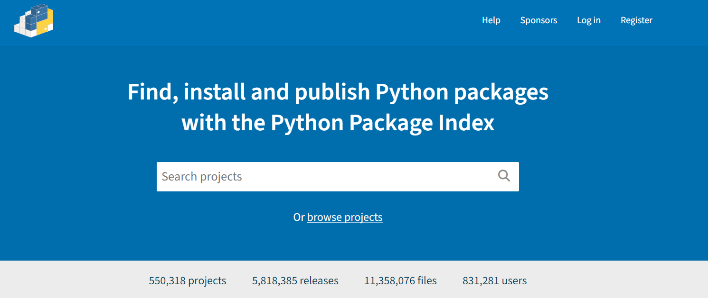

:::::::::::::::::::::::::::::::::::::: questions 

- How can I make my software easily accessible to a general audience?


::::::::::::::::::::::::::::::::::::::::::::::::

::::::::::::::::::::::::::::::::::::: objectives

- Become familiar with using GitHub to host software packages
- Learn how to publish Python packages on PyPI 
- Learn how to publish R packages on CRAN 

::::::::::::::::::::::::::::::::::::::::::::::::

## Finishing touches

### README 

You've created a package that conforms to your programming language's standards that provides functionality that might be useful to others.
This is the point at which you can start to think about releasing and publishing your software once some housekeeping has been taken care of.

Firstly, all packages must contain a `README.md` file that explains what the project is, how users can install it and how they can use it.
A good example of a `README.md` file may look something like:

```

# My Project

My Project is a simple utility tool designed to perform basic operations on text files.
Whether you need to count words, find specific phrases, or extract data, this tool has you covered.

## Installation

You can install My Project via pip:

$ pip install my-project

## Usage

from my_project import text_utils

text = "Lorem ipsum dolor sit amet, consectetur adipiscing elit."
word_count = text_utils.count_words(text)
print("Word count:", word_count)

This will output:

Word count: 9

```

Notice that the `README.md` should be included at the top level of our project directory.

::::::::::::::::::::::::::::::::::::: spoiler

### Python - referencing README in metadata

Your `README` should also be reference in `pyproject.toml` by adding in the following line:

``` toml

[project]
readme = "README.md"

```

::::::::::::::::::::::::::::::::::::::::::::::::

::::::::::::::::::::::::::::::::::::: spoiler

### R - Rmarkdown READMEs

In R, `README.md` can be automatically generated from an Rmarkdown `README.Rmd` file, allowing your example outputs to be generated directly from the code.

Refer to the [usethis documentation](https://usethis.r-lib.org/reference/use_readme_rmd.html) for further details.

::::::::::::::::::::::::::::::::::::::::::::::::

::::::::::::::::::::::::::::::::::::: callout

In the `README.md` file, developers also usually include in a "contributing" section for new users that are typically outside of the project.
The purpose of this section is to encourage new developers to work on the project, while ensuring they follow the etiquette set by the project developers.
This may look something like:

```
### Contributing

Contributions to My Project are welcome! If you'd like to contribute, please follow these steps:

1. Fork the repository.
2. Create a new branch for your feature (git checkout -b feature/new-feature).
3. Make your changes and ensure tests pass.
4. Commit your changes (git commit -am 'Add new feature').
5. Push to the branch (git push origin feature/new-feature).
6. Create a new Pull Request.
```

::::::::::::::::::::::::::::::::::::::::::::::::


### Licensing 

Following this, it is essential for your software to have a license to emphasise to users what their rights are in regards to usage and redistribution.
The purpose of this is to provide the developer with some legal protections, if needed.
There are many different open source licenses available, and it is up to the developer(s) to choose the appropriate license.
You can explore alternative open source licenses at [www.choosealicense.com](www.choosealicense.com).
It is important to note that your selection of license may be constrained by the licenses of your dependencies. 

The most common license used in open source projects is the [MIT license](https://en.wikipedia.org/wiki/MIT_License).
The MIT license is permissive, which allows users to freely use, modify, and distribute software while providing a disclaimer of liability.

::::::::::::::::::::::::::::::::::::: callout

The MIT License has the following terms:

Copyright (c) <year> <copyright holders>

Permission is hereby granted, free of charge, to any person obtaining a copy of this software and associated documentation files (the "Software"), to deal in the Software without restriction, including without limitation the rights to use, copy, modify, merge, publish, distribute, sublicense, and/or sell copies of the Software, and to permit persons to whom the Software is furnished to do so, subject to the following conditions:

The above copyright notice and this permission notice shall be included in all copies or substantial portions of the Software.

THE SOFTWARE IS PROVIDED "AS IS", WITHOUT WARRANTY OF ANY KIND, EXPRESS OR IMPLIED, INCLUDING BUT NOT LIMITED TO THE WARRANTIES OF MERCHANTABILITY, FITNESS FOR A PARTICULAR PURPOSE AND NONINFRINGEMENT. IN NO EVENT SHALL THE AUTHORS OR COPYRIGHT HOLDERS BE LIABLE FOR ANY CLAIM, DAMAGES OR OTHER LIABILITY, WHETHER IN AN ACTION OF CONTRACT, TORT OR OTHERWISE, ARISING FROM, OUT OF OR IN CONNECTION WITH THE SOFTWARE OR THE USE OR OTHER DEALINGS IN THE SOFTWARE.

::::::::::::::::::::::::::::::::::::::::::::::::

Both R and Python have a section in their corresponding metadata files for linking the `LICENCE` file:

R's `DESCRIPTION` file can be updated with the name of the licence and a reference to the file automatically by using the `usethis::use_mit_license()` or similar function (as described in the [Creating R Package episode](04_creating_r_packages.html#description))

```
License: MIT + file LICENSE
```

While Python's `pyproject.toml` has a `license` field for the same purpose.

``` toml
[project]
license = {file = "LICENSE"}
```


## Releasing software on GitHub

Once you have prepared all of the material above, you will be in a good position to release your software to a wider audience.
Given that you already hopefully using version control [(see the course for further details)](https://researchcodingclub.github.io/course/#version-control-introduction-to-git-and-github), you will already have access to a platform for hosting your software, as both R and Python can install packages from Git hosting providers, including GitHub.

In R the `pak` package is needed to install packages from GitHub, in the format `username/repository`.
This is very common practice as the large overhead to host packages on CRAN means many developers either solely host their package on GitHub or will host development versions on it.

```r
pak::pak("tidyverse/dplyr")
```

In Python this practice is less common for large packages but it is a perfectly valid route if you do not wish to host your package on PyPI.

```bash
pip install git+https://github.com/pandas-dev/pandas.git
```

If you are using GitHub to host your code, any new releases of your software should be explicitly 'tagged'.
Tags are a way of permanently tagging a specific point in your repository's history, which can be used to denote a version that is suitable for others to use.
A tag is an immutable reference to a commit (or series of commits), making it simple to identify specific versions of a software, and the tags are commonly identified in conjunction with the Semantic Versioning framework (e.g. v1.0.0).
For more information about how GitHub uses tags for software releases, see [releases](https://docs.github.com/en/repositories/releasing-projects-on-github/about-releases).

Tagging a release on GitHub involves going to your repository's page, clicking on the 'Releases' link on the right hand navigation bar, and following the steps to Draft a New Release by creating a new tag with the appropriate version number.
Others can then install your package referencing specific releases.


::::::::::::::::::::::::::::::::::::: callout

### Automating releases

GitHub Actions, introduced in the [Testing and Continuous Integration lesson](https://researchcodingclub.github.io/python-testing-for-research/10-CI.html) can also be used to automatically generate releases based on certain conditions - for example a tag being pushed that fits a certain format.

::::::::::::::::::::::::::::::::::::::::::::::::


::::::::::::::::::::::::::::::::::::: callout

Remember to **never** publish any sensitive information, such as passwords, directly on GitHub. Storing sensitive data in your repository makes it publicly accessible (if your repository is public) or easily accessible to anyone with repository access (if private). This can lead to unauthorised access, security breaches, and potential misuse of your code. Instead, use should use GitHub Secrets or environment variables to securely manage the sensitive information, ensuring it is kept safe and only accessible by authorised collaborators or workflows.

::::::::::::::::::::::::::::::::::::::::::::::::


## Publishing to PyPI

<figure style="text-align: center;">
    
    <figcaption><em>Figure 2: Screenshot of the main landing page of PyPI.</em></figcaption>
</figure>

[PyPI](https://pypi.org/) (or the Python Packaging Index) is the official package repository for the Python community.
It serves as the central location where developers can publish and share their packages, making them easily accessible to the wider community.
When we use `pip` to install packages from the command line, it fetches them from PyPI by default.
Uploading your packages to PyPI is recommended if you want to distribute your projects widely, as it allows other developers to easily find, install, and use your software.


::::::::::::::::::::::::::::::::::::: callout

Developers often use [TestPyPI](https://test.pypi.org/) for testing and validating packages before they are officially published on PyPI.

::::::::::::::::::::::::::::::::::::::::::::::::

To publish packages to PyPI two tools are needed:

1. `build`, which is a command-line tool used to build source distributions, and wheel distributions of Python projects based on the metadata specified in the `pyproject.toml`.
2. `twine` is the tool we use to securely upload the built distributions to PyPI, which handles tasks like authentication and transfer of package files.

These are both Python packages and can be installed by `pip`.

```bash
pip install build twine
```

Running `build` will create `dist/your-project-name-1.0.0.tar.gz` (source distribution) and `dist/your-project-name-1.0.0-py3-none-any.whl` (wheel distribution) in the dist directory.

```bash
python -m build

```

Next, we can use `twine` to a) validate the build and b) upload the package to TestPyPI to test everything is in order.

```bash
twine check dist/*

twine upload --repository testpypi dist/*
```

Once we have confirmed that everything works as expected on TestPyPI, we may proceed with installing our package to PyPI:


```bash
twine upload dist/*
```

Finally, once our package is available on PyPI other users can install it using the regular `pip` command:

```bash
pip install your-project-name
```

::: spoiler

### Publishing packages with `uv`

As with package development, `uv` also offers tooling for publishing without requiring the installation of any further dependencies.
In particular it has `build` and `publish` commands that handle these two steps - provided `uv` was set as the build-backend in `pyproject.toml`.

```bash
# Build the wheels and source package
uv build

# Publish to TestPyPI
uv publish --publish-url https://test.pypi.org/legacy/

# Publish to PyPI
uv publish
```


:::


## Publishing to CRAN

Publishing a package to CRAN is a very different matter to PyPI.
Whereas PyPI acts as an unregulated market where users can upload packages without any restrictions on their content, CRAN functions more akin to a boutique with a gatekeeper.
Any candidate packages must follow a stringent list of checks, including but not limited to:

  - Validating metadata (even down to ensuring the punctuation requirements are met)
  - The documentation builds
  - All tests pass
  
These checks will be run on both the latest release of R and the upcoming development version across all major operating systems, and will be run periodically if your package is accepted on CRAN with your package being at risked of being removed if it fails to fix any issues that appear.
Finally, all submissions will be assessed by human reviewers.
The submission process can be started via `devtools::submit_cran()` which will interactively step you through all the criteria and automate the process of building and uploading your package.
  
Given that R packages can be installed from GitHub very straightforwardly, why might you consider jumping through all the additional hoops for CRAN?
Essentially because it offers users of your software confidence that the package will run exactly as described and it meets a minimum threshold of quality.
This isn't to say that CRAN is always the right choice - for many small pieces of work GitHub will be a perfectly valid option.

::::::::::::::::::::::::::::::::::::: keypoints 

- R and Python packages can both be installed directly from GitHub
- GitHub allows you to create named releases using tags
- You can easily publish your package on PyPI for the wider Python community, allowing your users to simply install your software using `pip install`.
- Publishing a package on CRAN is a thorough process with a manual review

::::::::::::::::::::::::::::::::::::::::::::::::

